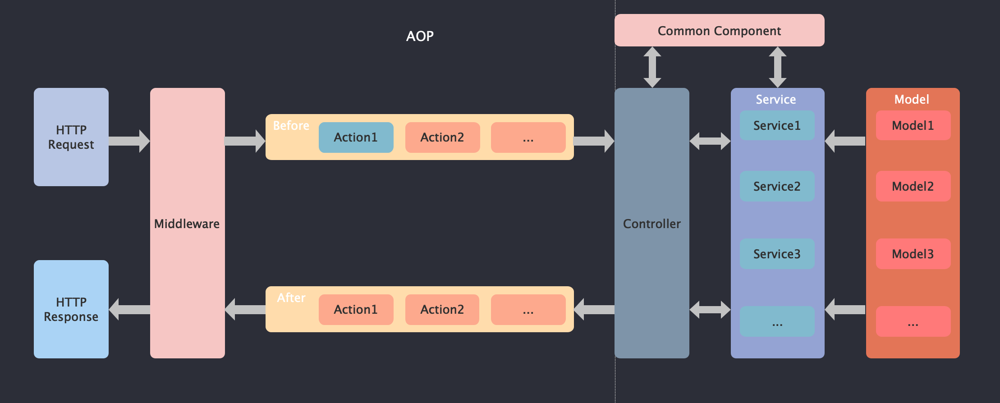

### 基础介绍
Kever是由一个突发奇想的兴趣应运而生。

### 框架原理
请求响应流程

### 安装

框架内部能力依赖`reflect-metadata`实现，因此在安装kever相关包时也需要将`reflect-metadata`这个包安装一下s

> npm install @kever/core @kever/ioc @kever/router @kever/logger reflect-metadata --save

框架整体采用Typescript实现，并且Ioc能力依赖Typescript装饰器，因此kever项目需要采用Typescript开发，需要将Typescript安装一下

> npm install typescript --save-dev